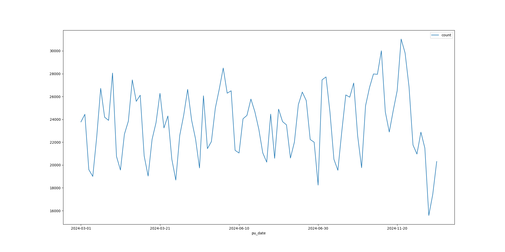
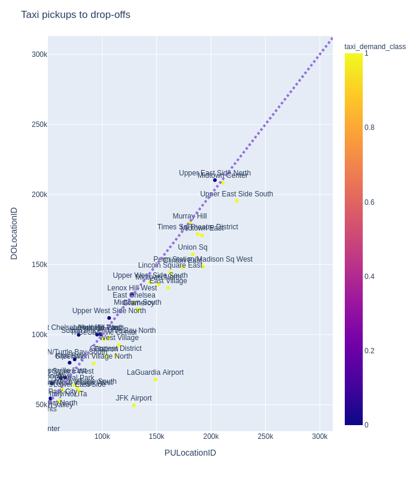

<div style="text-align:center">
    <p align="center">
        
    </p>
</div>


## Overview 

In this case study will analyse data collected from a fleet of yellow cabs in New York city during the months of March,June and November of 2017 to create a prediction model of the amount of tips that each journey will have.  The project can be split in two chapters one that is the data exploration and the modelling part. 


## Chapter 1. Data cleaning

During the exploration phase we identified couple of issues and here is a reporting section for it. The summary of the data exploration and insights per feature are discussed in a separate chapter. 


| Feature                 | Problem                        | Solution                                           | File |
| ----------------------- | ------------------------------ | -------------------------------------------------- | ---- |
| pickup/dropoff_datetime | Range extends selective month. | Restrict dates for each month. Remove other dates. |      |
| tip_amount              | Negative values on the tips.   | Keep only positive tip amounts                     |      |
| fare_amount             | Extremely large values         |                                                    |      |


By observing the description of our sample dataframe we can identiyf the problems 


|       | trip_distance | **fare_amount** | extramta_tax | mta_taxtip_amount | tip_amounttolls_amount | tolls_amountimprovement_surcharge | improvement_surchargetotal_amount | total_amountUnnamed: 0 | Unnamed: 0pu_month | pu_monthdo_month | do_month |
| ----: | ------------: | --------------: | -----------: | ----------------: | ---------------------: | --------------------------------: | --------------------------------: | ---------------------: | -----------------: | ---------------: | -------- |
| count |       5591791 |         5591791 |      5591791 |           5591791 |                5591791 |                           5591791 |                           5591791 |                5591791 |            5591791 |          5591791 | 5591791  |
|  mean |             2 |              13 |            0 |                 0 |                      1 |                                 0 |                                 0 |                     16 |            4768358 |                6 | 6        |
|   std |             3 |             266 |            0 |                 0 |                      2 |                                 1 |                                 0 |                    267 |            2838368 |                3 | 3        |
|   min |             0 |            -550 |          -42 |                 0 |                    -11 |                               -15 |                                 0 |                   -550 |                  2 |                3 | 3        |
|   25% |             0 |               6 |            0 |                 0 |                      0 |                                 0 |                                 0 |                      8 |            2327135 |                3 | 3        |
|   50% |             1 |               9 |            0 |                 0 |                      1 |                                 0 |                                 0 |                     11 |            4658592 |                6 | 6        |
|   75% |             3 |              15 |            0 |                 0 |                      2 |                                 0 |                                 0 |                     17 |            7023474 |               11 | 11       |
|   max |           733 |          630461 |           69 |               103 |                    450 |                               990 |                                 1 |                 630463 |           10294622 |               11 | 12       |


#### Date time problem 


<div style="text-align:center">
    <p align="center">
        
    </p>
    <p align="center" >  Figure X: Datetime extends the selective months.  </p>
</div>


As we can observe there are some random entries from months outside of the ones selected. 


| month index | count of features from sample data frame |
| ----------: | ---------------------------------------- |
|           1 | 4                                        |
|           3 | 2058926                                  |
|           6 | 1931399                                  |
|          10 | 48                                       |
|          11 | 1856889                                  |
|          12 | 20                                       |


## Chapter 2. Data exploration 

### Data overview

###  


### Spatial Distribution

Spatial information for each trip, is registered using a zone system. Specifically there are 258 zones that cover the five boroughs of New York. 


<div style="text-align:center">
    <p align="center">
        
    </p>
    <p align="center" >  Figure X: Taxi zones.  </p>
</div>


<div style="text-align:center">
    <p align="center">
        
    </p>
    <p align="center" >  Figure X: Taxi trips. Pickups to Drop-offs difference.  </p>
</div>


most people take a taxi from the airport to the city, touristic zones as Madison Sq, Theatre District might have more pickups due to their late nature of their activities, so people might go there with a public transport but when they finish their activity it might be late so they choose to take a taxi on their way back...


<div style="text-align:center">
    <p align="center">
        
    </p>
    <p align="center" >  Figure X: Taxi trips. Pickups to Drop-offs difference.  </p>
</div>


###  Temporal Distribution

We look on the distribution of trips per month. Three time-scales of each month will be visualised, monthly, per weekday and hourly  distribution. 


There is a huge drop on count of trips during March 14,2017. 


<div style="text-align:center">
    <p align="center">
        
    </p>
    <p align="center" >  Figure X: Count of taxi trips during March.  </p>
</div>


Googling the date, we can find that this was a date when the Nor'Easter blizzard hit the east coast of the North America. 


> A state of emergency was declared in New York City on March 13.
>
> [Western New York](https://en.wikipedia.org/wiki/Western_New_York) started getting hit by snow during the evening of March 13.[[82\]](https://en.wikipedia.org/wiki/March_2017_North_American_blizzard#cite_note-82) The strongest parts of the storm on March 14 ..

Source Wikipedia : https://en.wikipedia.org/wiki/March_2017_North_American_blizzard


Two other drops occur in our data set one during the PRIDE parade on June 25th and one during Thanksgiving day on 23rd of November. The trip counts are also very low on the days following the Thanksgiving day (24-25-26).


> Thoughts :  We could remove the day of the blizzard from the dataset, since we are not incorporate weather data at the moment, it is a skewed version of the average days we are building the model in.  Also the days of pride, thanksgiving and the three days following it (24-25-26/11) in that way we regularise our data.


<div style="text-align:center">
    <p align="center">
        
    </p>
    <p align="center" >  Figure X: Count of taxi trips hour distribution.  </p>
</div>


We can see how trips are fluctuate through the day. Rising during the early hours before the morning commute, picking in the early- after work hours and coming down as the night progress.


<div style="text-align:center">
    <p align="center">
        
    </p>
    <p align="center" >  Figure X: Weekday distribution. After removing the days with significant lower count of trips.  </p>
</div>

After removing the the days with significant lower than the average count of trips, we see the std to be low for each day. Friday and Saturday seems to be form the highs on taxi trips while Sunday and Monday the lows. 


> Thoughts :  If we were more interested about the temporal distribution, we could continue our analysis and group the data to weekdays/weekends .. see how the two are different etc. That would also be a better approach in building this information to hour prediction model. 


### 1.3 Further Feature Analysis


####  Amount of Tips

Having a look on the March data,  we can observe that we have registered some trips that have negative value of tips. 

```
mean            2.0
std             3.0
min           -91.0
25%             0.0
50%             1.0
75%             2.0
max           425.0
```


Taking a look on this subset of the dataset, we can see that most of the trips were cancelled and in a small percentage there is a dispute. 

```
Type of payment / Count of negative tip trips

No charge      64
Dispute         9
Credit card     4
```

> Thoughts : We will remove the negative trips and in our modelling dataset we will only keep  trips which the passengers used credit card as a type of payment.


## Chapter 2. Tip Prediction 


Having in mind the modeling part, we can also search for any underlying relation between the tip amount and some features of our data set.

<div style="text-align:center">
    <p align="center">
        
    </p>
    <p align="center" >  Figure X: Tip Correlation Matrix  </p>
</div>