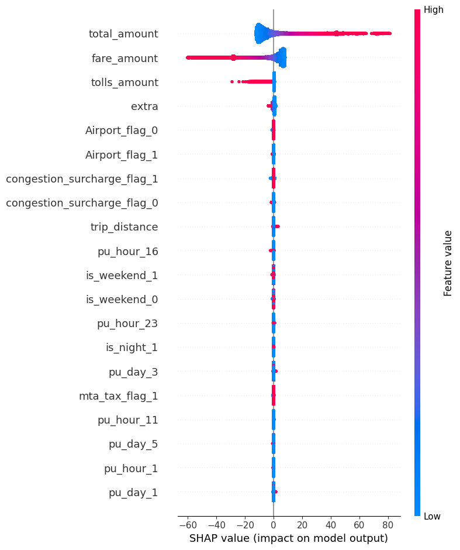

# NYC Taxi Tips – Predictive Modeling Report
My take on predicting tips on the NYC taxi dataset


<div style="text-align:center">
    <p align="center">
        
    </p>
</div>

# Input data
We use NYC Yellow Taxi trip data for March, June, and November 2024, sourced from the TLC Trip Record dataset.


## Data Sampling
For efficiency, 20% of each monthly dataset was retained for modeling. 

## Data processing


There are some critical issues on the given dataset, which are adressed as follows:


| Issue | Action |
| -------- | ------- |
|Missing values exist in most of attributes | Dropped NA records   |
|Negative Values on fares,tips amounts,tolls and extra | Filtered to retain only positive entries |
|Wrong dates in the dataset (wrong year and months) | Filter only the ones targeted        |
|Vendor IDs are not concistent across different datasets| Subset selected for consistency
 |


## Feature Engineering

To explore more options while modeling there are a number of new features that are being introduced 

| Feature | Comment |
| -------- | ------- |
| Month, day, hour | Transform PU & DO time of the trip |
| Duration_s |Duration of the trip measured in seconds |
| PULocationID / DOLocation |Transform to categorical vector using OHE |
| Airport,congestion and mta tax Flags | Transform values to a binary flag |


## Data exploration 


### Spatial Distribution

Spatial information for each trip, is registered using a zone system. Specifically there are 258 zones that cover the five boroughs of New York. 


<div style="text-align:center">
    <p align="center">
        
    </p>
    <p align="center" >  Figure 1: Taxi zones.  </p>
</div>


<div style="text-align:center">
    <p align="center">
        
    </p>
    <p align="center" >  Figure 2: Taxi trips. Pickups to Drop-offs difference.  </p>
</div>


The data leverages the TLC's 258-zone system. Trip flows show:

- More drop-offs in Manhattan and tourist-heavy zones (Theatre District, Madison Square).

- Higher pickups near airports, indicating inbound travel.

Figure 2 illustrates the imbalance between pickups and drop-offs. This might be driven by trip purpose (commute vs leisure) and transportation access (public transport vs taxi).


<div style="text-align:center">
    <p align="center">
        
    </p>
    <p align="center" >  Figure 3: Taxi trips. Pickups to Drop-offs difference.  </p>
</div>


###  Temporal Distribution


<div style="text-align:center">
    <p align="center">
        
    </p>
    <p align="center" >  Figure 4: Count of trips per day of the month.  </p>
</div>


Trip volume varies :

- March and June show consistent volumes.

- November 27th sees a drop—likely due to Thanksgiving.

- Morning hours (4–6 AM) exhibit higher average tips—possibly due to airport trips or early commutes.


<div style="text-align:center">
    <p align="center">
        
    </p>
</div>


<div style="text-align:center">
    <p align="center">
        
    </p>
</div>


## Modeling Experiments

For better tracking and reproducability all experiments were tracked using MLflow below there are two comperative plots of R² and MSE on the test sets, showing the performance of each model


<div style="text-align:center">
    <p align="center">
        
    </p>
</div>


<div style="text-align:center">
    <p align="center">
        
    </p>
</div>


The best-performing model was CatBoostRegressor, which achieved strong predictive accuracy:

```
MAE: 0.474
MSE: 1.051
RMSE: 1.025
R²: 0.933
```


### Linear Models
First inuition on looking on some correlated values and try to fit a linear model.

<div style="text-align:center">
    <p align="center">
        
    </p>
</div>

Starting simple we use only the fare_amount and the results are the following

Model Evaluation:
|Model | MSE| R²|
|--------------------|--------------|-----------|
|Dummy Mean           | MSE: 15.6497 | R²: -0.0000|
|Dummy Median         | MSE: 17.0848 | R²: -0.0917|
|Linear Regression    | MSE: 3.8599 | R²: 0.7534|
|Decision Tree        | MSE: 4.0165 | R²: 0.7433|


Although the statistical metrics are positive, the residuals do not distribute normally and the conical shape of the Residuals vs Fitted values suggests heteroscedacity in the model. 

In addition the fare_amount some additional parameters were introduce on the model such as:


- fare_amount
- Airport_flag
- trip_distance
- congestion_surcharge_flag
- mta_tax_flag


<div style="text-align:center">
    <p align="center">
        
    </p>
</div>


#### Transforming the input data

Trying to work on the heteroscedacity i tried to apply a log transformation on my target variable

<div style="text-align:center">
    <p align="center">
        
    </p>
</div>


### Regularisation of the lm model

Trying to resolve heteroscedacity with Regualirsation I applied Elastic Net on my training data 

``` 
Elastic Net          | MSE: 4.3846 | R²: 0.7198

tip_amount = 0.9210 + 0.1745*fare_amount + 0.0000*Airport_flag + 0.0801*trip_distance + 0.0000*congestion_surcharge_flag + 0.0000*mta_tax_flag
```

the performance was slightly worst in terms of coverage, the results show the significance of fare_amount and trip_distance features.


### HistGradientBoostingRegressor

`
MAE: 0.074
MSE: 0.040
RMSE: 0.200
R²: 0.921
`

### RandomForestRegressor
`RFRegressor          | MSE: 1.5760 | R²: 0.8783`

### CatBoostRegressor

The best result was performed when using CatBoost.A test was conducted on introducing the temporal aspect of each trip as a categorical value. Below we can observe the importance of each feature.

`Cateogrical values where treated with OneHotEncoder`

<div style="text-align:center">
    <p align="center">
        
    </p>
</div>


## Other experiments on Spatio-temporal analysis

Q: Is there a siggnificant temporal corelation to the tip amount?


<div style="text-align:center">
    <p align="center">
        
    </p>
</div>


Conducted time-series correlation between pickup datetime and tip amount.

```
Spearman Correlation: -0.0029, p-value: 1.4924e-05
```

` statistically significant but weak in magnitude.`

Q: Do tipping patterns correlate with zone-level socioeconomic or spatial features?

Starting to conduct a basic spatial correlation analysis, further analysis needs to be conducted.


## Additional analyis

Use of GeoGNN 


## Further Steps

- Integrate ACS & POI data to capture socio-economic and behavioral patterns across zones (e.g., median income, commercial density).

- Weather & event data: Incorporate historical weather (e.g., rain, heatwaves) and major city events to model temporal anomalies in tipping behavior.